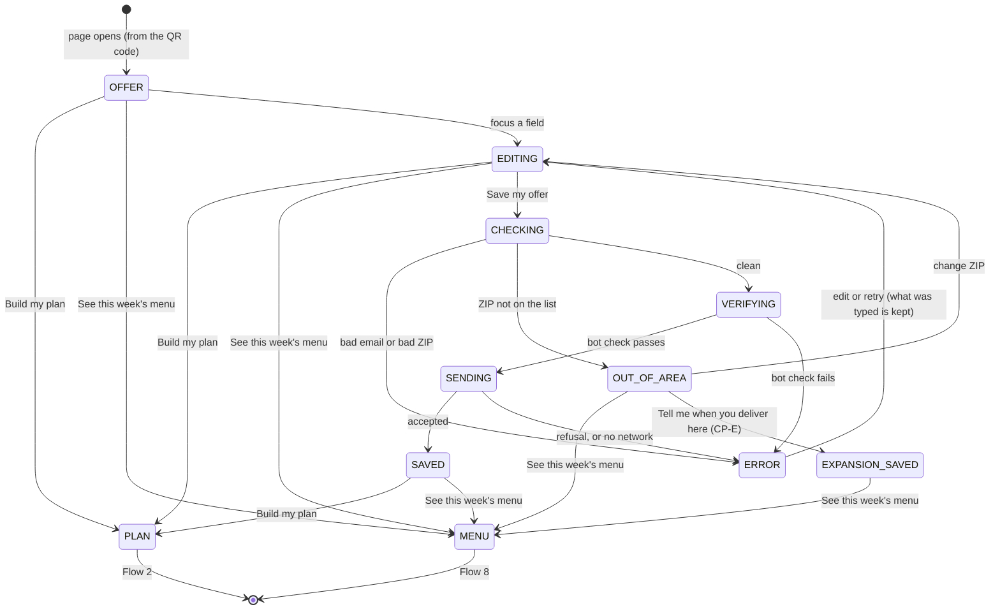

# Flow 1 — save the offer (first, and dismissible)

**Status: PROPOSED.** It replaces the claim form built on dev, which came **after** choosing a plan and
offered email and text. The order is now inverted: **the offer comes first, email only**, and the
visitor may skip it.

## 1. Purpose

A visitor who scans the code may not buy right now. They may still want to **lock in the offer**. So the
first thing the page offers is a **reminder for tomorrow**: *"Save your offer — we'll email your code
tomorrow, with a link back here."* That is **one message**, the one they asked for. Instead of saving,
they can say what they came for: set up a plan, or see this week's menu.

**Rules this flow keeps**:

- Saving the offer needs **only an email** to send it to.
- Marketing email is a **separate, optional, unticked** box.
- Skipping is always one tap, and **the store never waits behind this step**.

## 2. The screen

```
            Your Boston offer
     [the offer — e.g. "N free meals on your first order"]

  Not ready today? Save it — we'll email your code tomorrow,
  with a link back here.

  Email      [____________________]
  ZIP        [_____]   so we can check we deliver to you
  ☐ Also email me Fit AF menus and offers. About once a week; unsubscribe anytime.

  [ Save my offer ]

  Or:   Build my plan →        See this week's menu →
```

⬜ **The two skip links** (their words are open; *"set my plan"* is not quite right). They are the two
things a person who skips is saying. If two feels like too much, the fallback is one **Not now** that
lands on Flow 2, with the menu one tap from there.

## 3. States



| state | the page shows |
|---|---|
| `OFFER` | the offer, the empty form, the two skip links |
| `EDITING` | the form being filled |
| `CHECKING` | (instant) email syntax; a five-digit ZIP; the ZIP against the list (§ 5) |
| `OUT_OF_AREA` | *"We don't deliver to 0xxxx yet."* and **Tell me when you deliver here** (§ 5) |
| `EXPANSION_SAVED` | *"Thanks — check your email to confirm, and we'll let you know."* and the menu link |
| `VERIFYING` · `SENDING` | the button disabled |
| `ERROR(kind)` | the form, as filled, with one message. On weak gym wifi, **retry keeps everything typed** |
| `SAVED` | *"Saved — look for it tomorrow at you@…"*, and the same two links |
| `PLAN` · `MENU` | leave for Flow 2 or Flow 8. After a skip, a small **Save my offer** link stays in reach there |

## 4. Data sent

| field | note |
|---|---|
| `email` | required |
| `zip` | required: § 5 |
| `consent_marketing_email` | explicit `true`/`false`; `false` unless ticked |
| `event_id` | from the entry path (Flow 2 § 6) |
| `wording_version` | the exact text shown |
| bot-check token | checked, then discarded |

⭐ **No plan is sent**: the plan is chosen afterwards (§ 6).

**One save per (event, email)**: saving again updates the first save and never mints a second code. The
response is `{ok:true}` either way, so it reveals nothing about whether the address saved before.

## 5. The ZIP list — a MOCK for now

`data/delivery-zips.json` is a **mock** of greater Boston by three-digit ZIP prefix, and says so in its own
`status` field. ⛔ **It must be replaced by the store's official delivery list before production**; a
production build refuses a list whose status is `mock`.

⭐ **Out of area — join the expansion list** (ruled 2026-09-27). The visitor learns it before giving anything
else, and may ask to hear when delivery reaches them:

- **Tell me when you deliver here** saves the email and ZIP **without an offer code**: the offer cannot be
  used where there is no delivery.
- It is **its own consent** (CP-E), scoped to expansion news for that area. It is not general marketing,
  and it is confirmed from the inbox like marketing is (Flow 3 § 5).
- ⭐ **The ring**: the Worker classifies the ZIP as `near` (the ring just outside today's reach,
  `near_ring` in the same mock file) or `far`, so expansion can be aimed at the nearest areas first. The
  class is derived from the ZIP and stored with it.
- ⬜ **How long it is kept**: expansion may never reach them, so the record needs a limit. Proposed: 12
  months, or until they are told, whichever comes first.

## 6. The email does not remember the plan chosen afterwards (October)

The email's link reopens the offer page (Flow 5), and they choose again. Remembering a later choice would
need the save to hand the page an id, which the contract forbids. Reconsider with Chef's Choice, where
reopening a whole pre-filled week is worth more.

## 7. Consent points

| id | the act | means | evidence |
|---|---|---|---|
| **CP1** | **Save my offer** | send **this code once, the next day**, with a link back. A service they asked for, **not** marketing | the save, time, wording version |
| **CP2** | the marketing box, then save | marketing email, **pending** until confirmed from the email (Flow 3) | `consent_marketing_email = true`, time, wording version |
| **CP-E** | **Tell me when you deliver here** (out of area only) | expansion news for that area, **pending** confirmation from the inbox | `consent_expansion = true`, ZIP, ring, time, wording version |

⛔ **Nothing here is pre-ticked, and nothing here is required to reach the store.**
