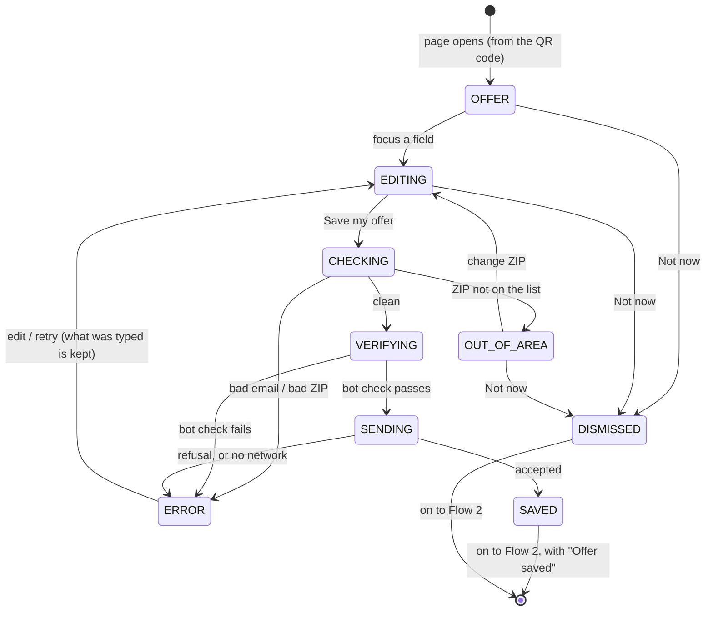

# Flow 1 — save the offer (first, and dismissible)

**Status: PROPOSED.** It replaces the claim form built on dev, which came **after** choosing a plan and
offered email and text. The order is now inverted: **the offer comes first, email only**, and the
visitor may skip it.

## 1. Purpose

A visitor who scans the code may not buy right now. They may still want to **lock in the offer**. So the
first thing the page offers is a **reminder**: *"Save your offer — we'll email you your code, with a link
back here."* That is **one message**, the one they asked for. After it, or instead of it, they choose a
plan (Flow 2).

**Rules this flow keeps**:

- Saving the offer needs **only an email** to send it to.
- Marketing email is a **separate, optional, unticked** box.
- **Not now** is always one tap, and **the store never waits behind this step**.

## 2. The screen

```
            Your Boston offer
     [the offer — e.g. "N free meals on your first order"]

  Save it for later — we'll email you your code, with a link back here.

  Email      [____________________]
  ZIP        [_____]   so we can check we deliver to you
  Send it    ( now )  ( this evening )  ( tomorrow morning )      ← § 5, proposed
  ☐ Also email me Fit AF menus and offers. About once a week; unsubscribe anytime.

  [ Save my offer ]                          Not now →
```

## 3. States



| state | the page shows |
|---|---|
| `OFFER` | the offer, the empty form, **Not now** |
| `EDITING` | the form being filled |
| `CHECKING` | (instant) email syntax; a five-digit ZIP; the ZIP against the list (§ 6) |
| `OUT_OF_AREA` | *"We don't deliver to 0xxxx yet."* ⬜ what else it offers is a business question (§ 6) |
| `VERIFYING` · `SENDING` | the button disabled |
| `ERROR(kind)` | the form, as filled, with one message. On weak gym wifi, **retry keeps everything typed** |
| `SAVED` | Flow 2, with a line at the top: *"Offer saved — it's on its way to you@…"* (or *"… this evening"*) |
| `DISMISSED` | Flow 2, with a small **Save my offer** link kept in reach |

## 4. Data sent

| field | note |
|---|---|
| `email` | required |
| `zip` | required: § 6 |
| `send_at_choice` | `now` · `evening` · `morning`: § 5 |
| `consent_marketing_email` | explicit `true`/`false`; `false` unless ticked |
| `event_id` | from the entry path (Flow 2 § 5) |
| `wording_version` | the exact text shown |
| bot-check token | checked, then discarded |

⭐ **No plan is sent.** The plan is chosen **after** the save. Whether the reminder remembers the later
choice is the fork in § 7.

**One save per (event, email)**: saving again updates the first save (a new send time, a ticked box) and
never mints a second code. The response is `{ok:true}` either way, so it reveals nothing about whether the
address saved before.

## 5. ⬜ Fork: when the email goes

| | now | a fixed delay (30–60 min) | ⭐ **they choose**: now · this evening · tomorrow morning |
|---|---|---|---|
| proves it arrived | ✅ while they are still standing there | ❌ | ✅ for *now*; otherwise they chose |
| feels like | a receipt | a nudge | ⭐ **a reminder they set**, which is how the step is worded |
| "only if they haven't bought" | ⚠ **not possible: we have no signal of a purchase** (the store's orders are not visible to us) | ⚠ same | ⚠ same |

⭐ **Recommended: they choose, with "this evening" preselected.** It matches the *reminder* wording,
makes the timing part of what they asked for, and never needs a purchase signal we lack. Whatever the
choice, the message is worded to be harmless to someone who has already ordered (*"If you've already
used it, enjoy your meals!"*).

**The mechanism** is the same for every option: the save stores a `send_at`, and a scheduled Worker (a
cron trigger every few minutes) sends what is due. *Now* is simply `send_at = now`.

## 6. The ZIP list — a MOCK for now

`data/delivery-zips.json` is a **mock** of greater Boston, by three-digit ZIP prefix, and says so in its own
`status` field. ⛔ **It must be replaced by the store's official delivery list before production**; a build
for production refuses a list whose status is `mock`.

⬜ **Out of area**: the visitor learns it before giving anything else. Whether they may still save the
offer (a friend in range, a move) is the Owner's call. Until then, `OUT_OF_AREA` offers only **Not now**.

## 7. ⬜ Fork: does the reminder remember the plan chosen afterwards?

| | ⭐ **no — the link opens the offer page** | yes — the link reopens their plan |
|---|---|---|
| how | the email links to the microsite; they choose again (two taps) | the save response returns an opaque handle, the page keeps it, and it sends the plan when one is chosen |
| data | email, ZIP, the event | + the plan, + a handle held in their browser |
| contract | unchanged (the response carries nothing) | amends "the response never carries an id" |

⭐ **Recommended for October: no.** Two taps is a small cost, and the flow stays one request with nothing
held in the browser. Reconsider with Chef's Choice, where reopening a whole pre-filled week is worth more.

## 8. Consent points

| id | the act | means | evidence |
|---|---|---|---|
| **CP1** | **Save my offer** | send **this code once**, at the chosen time, with a link back. A service they asked for, **not** marketing | the save, time, `send_at_choice`, wording version |
| **CP2** | the marketing box, then save | marketing email, **pending** until confirmed from the email (Flow 3) | `consent_marketing_email = true`, time, wording version |

⛔ **Nothing here is pre-ticked, and nothing here is required to reach the store.**
