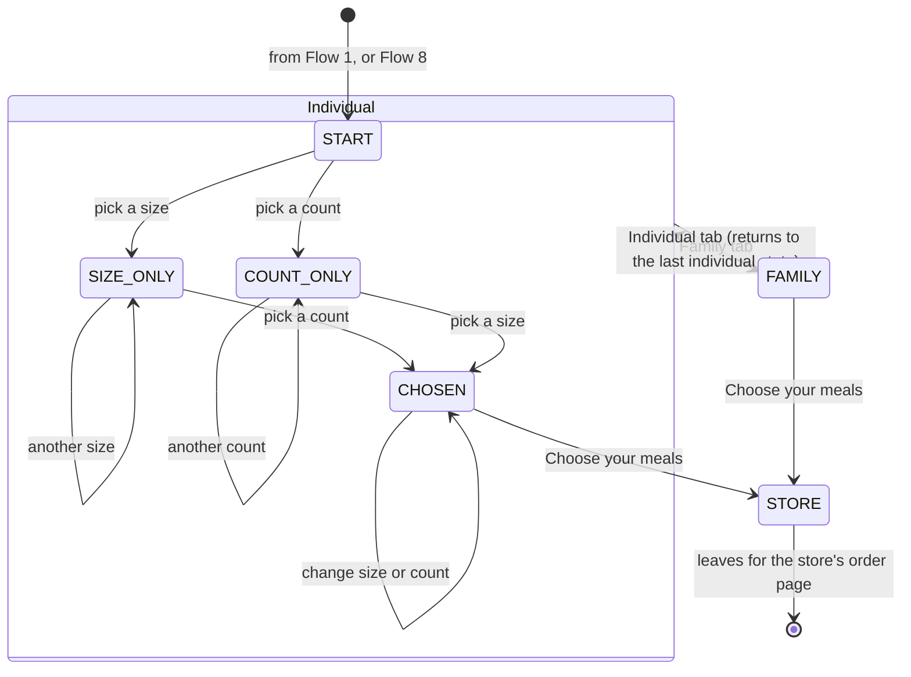

# Flow 2 — build a plan: meal size, then how many

**Status: BUILT (rung 1, live) as "goal, then count"; to be REWRITTEN.** The rewrite reframes the first
question as **meal size** (§ 2) and will add meal photography (§ 8).

## 1. Purpose

The visitor picks **a meal size** and **how many meals a week**, and leaves for the store's order page
for that plan. Nothing is collected in this flow.

## 2. ⭐ Question 1 is a size, not a goal

The three individual plans are **portion sizes**. The page says what each size **provides**, and the
person decides for themselves. ⛔ **No advice**: the page never says which size a person *should* eat,
never asks why, and uses no goal language of its own.

| size | per meal (the store's published ranges) |
|---|---|
| Lean | 250–450 cal · 25–35 g protein |
| Signature | 450–650 cal · 35–60 g protein |
| Performance | 650–850 cal · 50–65 g protein |

The numbers are the plan table's, read from the store's public plans page. The page shows them; it does
not interpret them.

### ⬜ Optional: "What share of my day is that?"

A person who knows their own daily target **may** type it in: protein in grams, or calories. The page then
does the arithmetic and nothing more:

> Your target: **150 g protein a day**
> Lean: **17–23 %** per meal · Signature: **23–40 %** · Performance: **33–43 %**
> At 14 meals a week (2 a day): Signature covers **47–80 %** of your day's protein.

- It is **arithmetic on the person's own number**: range ÷ target, rounded, shown as a range.
- ⛔ **The number never leaves the browser**: not sent, not stored, not in the URL, not in the fragment.
  A daily need is health-adjacent data, and the page does not need to keep it.
- ⛔ The page does not suggest a target, validate it against anything, or react to a high or low one.
  Anything more is expert territory.

## 3. States

The whole state is three values, all in the URL fragment. The optional target is page memory only and
is **not** part of it.

| value | domain | fragment |
|---|---|---|
| `tab` | `individual` · `family` | `#family`, or anything else means individual |
| `size` | `lean` · `signature` · `performance` · none | `#lean` |
| `count` | a shown count (`7` · `14`) · none | `#meals-14` (count, no size) · `#lean-14` (both) |

The share calculator is not a state of this machine. It is a separate panel, open or closed, whose one
input changes only its own numbers.

| state | the page shows |
|---|---|
| `START` | the three sizes with their numbers, the two counts, a hint |
| `SIZE_ONLY` · `COUNT_ONLY` | the pressed choice; the hint |
| `CHOSEN` | **the result card**: size, meals a week, price per meal, weekly total, **Choose your meals** |
| `FAMILY` | the family plan, its price, its button |

Back and forward replay the fragment. **See all plans** (the 3 × 2 grid) is a separate toggle. An
unknown fragment reads as `START`.

## 4. Question 2 — how many

*Lunch or dinner* (7 a week) · *Lunch and dinner* (14 a week). The counts are data (`data/plans.json`),
so another count is a data change, not a code change.

## 5. Data

- **Read**: the plan table (sizes, per-meal ranges, shown counts, the store's plan id per cell, price per
  meal in cents). The build computes weekly totals; the page only displays them.
- **Written**: nothing. **No JavaScript**: the grid and Family card are shown, and every link works.

## 6. ⬜ Proposed: the event comes from the entry URL

One QR code per event. Each event gets an entry path, `/<event-id>/`, with that event id built in, and its
QR code encodes that path. ⚠ An event id is public; it must never name a person.

## 7. Onto the store

**Choose your meals** → the plan's order page. Rung 2 (planned) adds a pre-filled cart, and **without it,
the link is exactly this one**.

## 8. ⬜ The rewrite: meal photography

The rewrite shows meals, not only plans. The photographs are chosen from the enterprise's own image corpus
by **heuristics plus an aesthetic model (to be chosen)**.

- The selection runs **outside** this repository. Its **output** (public images with a manifest of meal →
  image, chosen on a date) is this microsite's input, rebuilt weekly with the menu.
- ⛔ **Every image that reaches this repository is public**: a meal as it is sold, no people or kitchen
  interiors unless cleared, metadata stripped.
- The page is opened on gym wifi: phone-sized images, lazy-loaded below the first screen.
