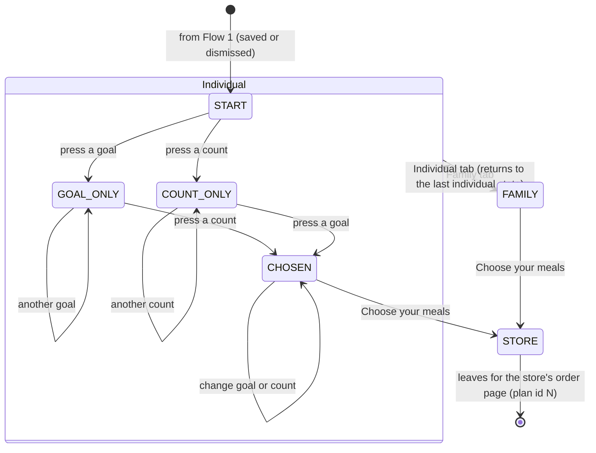

# Flow 2 — choose a plan

**Status: BUILT (rung 1, live), and to be REWRITTEN.** This document describes the page as it is, so
the other flows have something fixed to attach to. The rewrite will use **meal photography** (§ 7) and is
not designed here.

## 1. Purpose

After the offer step (Flow 1: saved or dismissed), the visitor answers two questions (*how much* and
*how often*) and leaves for the store's order page for that plan. Nothing is collected in this flow.

## 2. States

The whole state is three values, all three in the URL fragment:

| value | domain | fragment |
|---|---|---|
| `tab` | `individual` · `family` | `#family`, or anything else means individual |
| `goal` | `lean` · `signature` · `performance` · none | `#lean` |
| `count` | a shown count (`7` · `14`) · none | `#meals-14` (count, no goal) · `#lean-14` (both) |

Back and forward replay the fragment: every choice pushes a history entry. **See all plans** is a
separate toggle, not in the fragment, and shows the 3 × 2 grid, every cell of which also leads to `STORE`.

| state | the page shows |
|---|---|
| `START` | question 1 and question 2, and a hint |
| `GOAL_ONLY` · `COUNT_ONLY` | the pressed choice; the hint |
| `CHOSEN` | **the result card**: plan, meals a week, price per meal, weekly total, **Choose your meals** |
| `FAMILY` | the family plan, its price, its button |

An unknown fragment reads as `START`. A goal or count missing from the plan table is dropped, not
guessed.

## 3. Data

- **Read**: the plan table (plans, shown counts, the store's plan id per cell, price per meal in cents).
  The build computes the weekly totals, and the page script only displays them.
- **Written**: nothing. The fragment is the only memory, and it never leaves the browser.
- **No JavaScript**: the questions are hidden and the grid and Family card are shown, so every link still
  works.

## 4. How Flow 1 shows here

- After `SAVED`: a line at the top, *"Offer saved — on its way to you@… (this evening)"*.
- After `DISMISSED`: a small **Save my offer** link stays in reach and reopens Flow 1.

## 5. ⬜ Proposed: the event comes from the entry URL

**One QR code per event**, swapped on the signage. Today the event is a single fixed value in the build,
so every save would record the same event. ⇒ Each event gets its own entry path, `/<event-id>/`, which
serves the same page with that event id built in, and its QR code encodes that path. The event list is
already data (`data/events.json`).

⚠ An event id is public (it is on a sign). It must never name a person.

## 6. Onto the store

**Choose your meals** → the plan's order page. Rung 2 (planned: `SPEC-rung2-cart-handoff.md`) adds a
pre-filled cart, and **without it, the link is exactly this one**.

## 7. ⬜ The rewrite: meal photography

The rewrite will show meals, not only plans. The photographs are chosen from the enterprise's own image
corpus by **heuristics plus an aesthetic model (to be chosen)** that pick the best shot of each meal.

- **After this lands, what regenerates it, and from what?** The selection runs **outside** this
  repository. Its **output**, a set of public images with a manifest (meal → image, chosen on a date), is
  this microsite's input, rebuilt weekly with the menu. Nothing in this repository runs the model.
- ⛔ **Every image that reaches this repository is public.** It must already be publishable (a meal as it
  is sold), carry no people, labels or kitchen interiors unless cleared, and have its metadata stripped.
- Size budget: the page is opened on gym wifi, so the build emits phone-sized images, lazy-loaded below
  the first screen.
