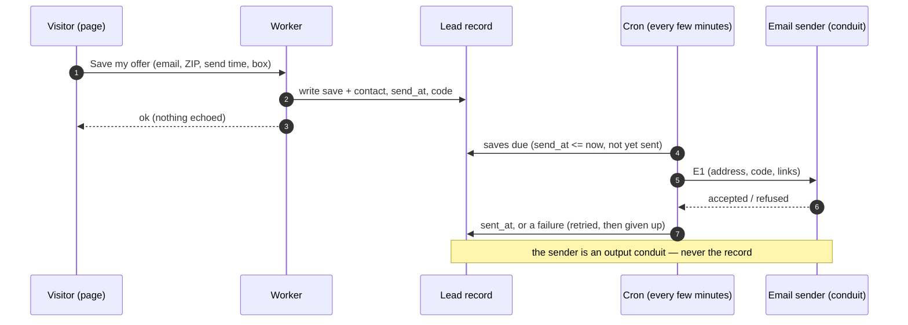
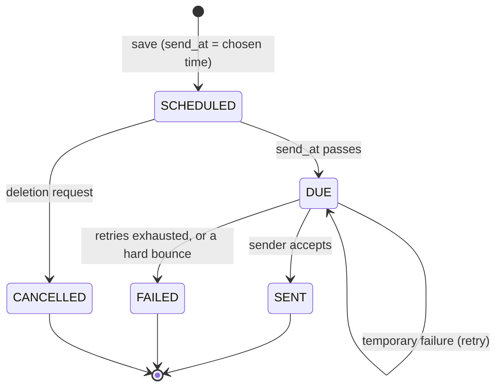
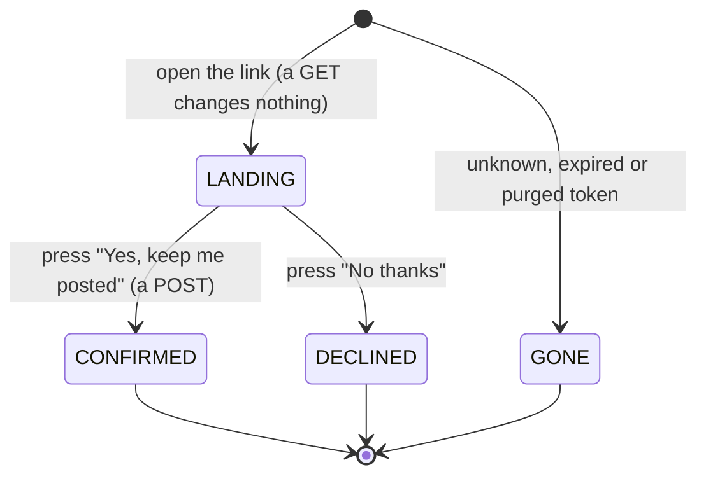

# Flow 3 — the one-time email: the code, a link back, and the marketing confirmation

**Status: PROPOSED, not built.** The sender is to be set up; the setup another team already runs well is
the model.

## 1. Purpose

Flow 1's save asked for **one** email: the code, sent at the chosen time, with a link back to the
microsite. This flow is that email, and the only other thing it may do: let someone who ticked the
marketing box **confirm** it (double opt-in).

## 2. The message — E1, "Your Fit AF offer code"

- **The code**, large and copyable, with its expiry date.
- **Choose your plan →** a link to the microsite's event page (Flow 2). ⛔ It carries **no token and no
  personal data**, so it can be forwarded without harm.
- **Only if the marketing box was ticked**: *"You asked to hear about menus and offers. **Yes, keep me
  posted →**"* This links to `/confirm/<token>` (§ 4). Without that click, **no marketing email is sent,
  ever**.
- Why they are getting it (*"you saved this offer at [event] on [date]"*), the postal address, and a line
  that makes it harmless to someone who already ordered (*"Already used it? Enjoy your meals!"*).
- ⛔ **One message.** It is the reminder they set; there is no second one unless they confirmed the
  marketing box.

## 3. Sending

| state of E1 | means |
|---|---|
| `SCHEDULED` | saved; `send_at` in the future |
| `DUE` | `send_at` has passed; the next cron picks it up |
| `SENT` | the sender accepted it |
| `FAILED` | refused or bounced after retries. ⛔ **Never re-sent to a different address**, and never retried beyond the limit |
| `CANCELLED` | deleted on request before it went (Flow 6) |

## 4. The marketing confirmation page — `/confirm/<token>`

`<token>` is random, used only for this, and expires with the offer. It is **not** the offer code.

| state | the page shows | effect |
|---|---|---|
| `LANDING` | what they will get, how often, how to stop; **Yes, keep me posted** · **No thanks** | none |
| `CONFIRMED` | *"You're on the list."* and **Choose your plan** | CP3: marketing confirmed; the contact becomes exportable (Flow 6) |
| `DECLINED` | *"No problem — you won't hear from us again."* | the box is recorded as withdrawn |
| `GONE` | *"This link is no longer active."*, the same for every cause | none: it reveals nothing about any address |

⭐ **A button, not the link**: many mail systems open every link in an incoming email to scan it, so a
link that confirmed on opening would be confirmed by a machine. The GET only shows the page, and a person
makes the POST.

Security: the token is never logged; `Referrer-Policy: no-referrer`; `Cache-Control: no-store`; `noindex`;
lookups are rate-limited per IP.

## 5. Consent points

| id | the act | means | evidence |
|---|---|---|---|
| **CP3** | **Yes, keep me posted** | marketing email confirmed (double opt-in: box ticked **and** confirmed from the inbox) | `consent_marketing_confirmed_at`, the wording version of the confirmation page |
| **CP-W1** | the unsubscribe link in any later marketing email, or **No thanks** here | marketing withdrawn, as easily as given | the time; forwarded to the conduit if exported |

## 6. Data given to the sender

The address, the code, the two links, and the event's public name. Nothing else. The sender is an
**output conduit**; the record is Flow 6's.

⬜ **To set up**: a sending domain (the vanity domain, once bought) with its authentication records
(SPF, DKIM, DMARC), and the sender account in the enterprise's name.
