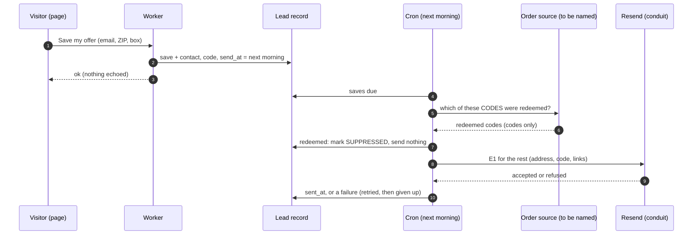
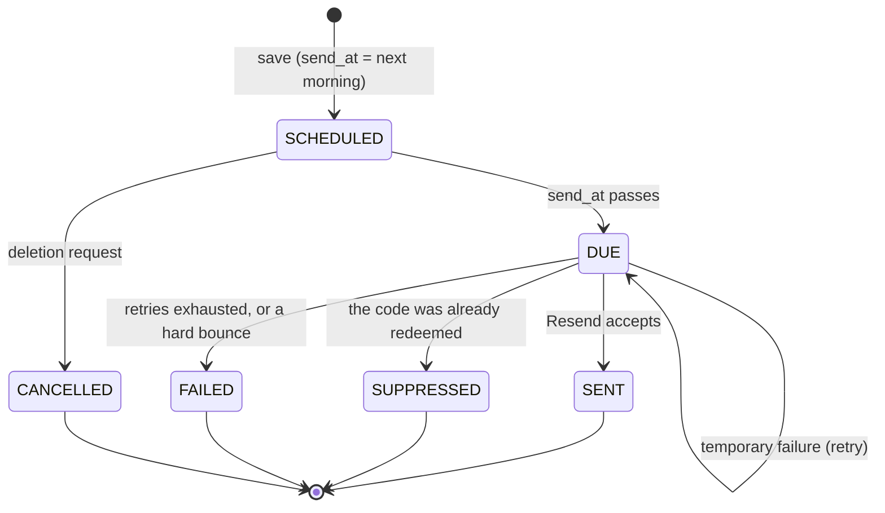
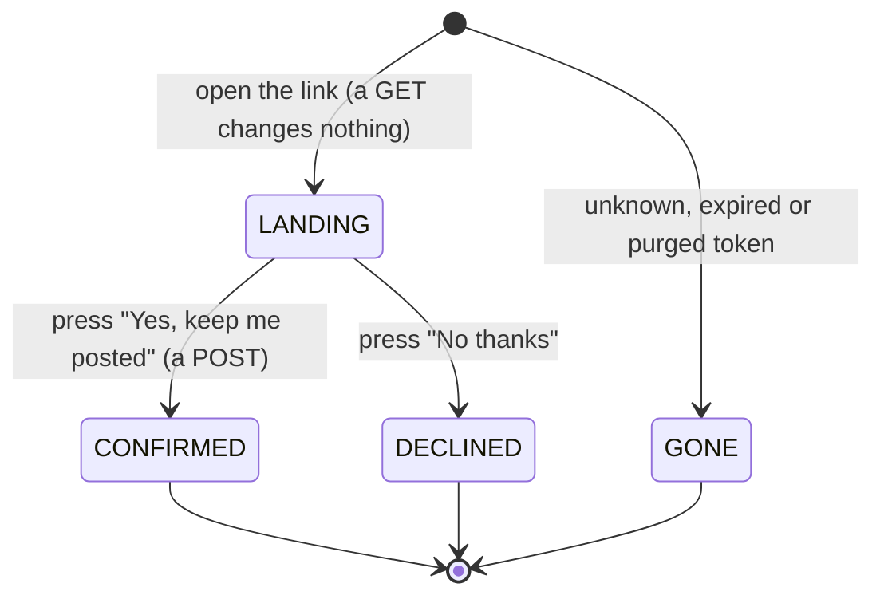

# Flow 3 — the next-day email: the code, a link back, and the marketing confirmation

**Status: PROPOSED, not built.** Sent through **Resend**, from a dedicated Fit AF account on the vanity
domain (both being set up).

## 1. Purpose

Flow 1's save asked for **one** email: the code, **the next day**, with a link back. The day's wait lets
the day's orders come through first, so someone who already ordered can be left alone (§ 3). Apart from
that, the email may do one other thing: let someone who ticked the marketing box **confirm** it (double
opt-in).

## 2. The message — E1, "Your Fit AF offer, as promised"

- Framed as the **reminder they set yesterday**: *"You saved this offer at [event] yesterday. Here it is."*
- **The code**, large and copyable, with its expiry date.
- **See my offer →** `https://<site>/o/<code>` (Flow 5). The link carries the **offer code** and nothing
  else, which is the holder's own and harmless to forward. ⭐ **It keeps working after the code expires**,
  and then offers whatever is current (Flow 5 § 3).
- **Only if the marketing box was ticked**: *"You asked to hear about menus and offers. **Yes, keep me
  posted →**"* This links to `/confirm/<token>` (§ 5). Without that click, **no marketing email is sent,
  ever**.
- The postal address, and a line that is harmless to someone who ordered anyway (*"Already ordered? Enjoy
  your meals!"*).
- ⛔ **One message.** There is no second one unless they confirmed the marketing box.

### E-X — the expansion confirmation (out-of-area visitors only)

Someone who chose **Tell me when you deliver here** (Flow 1, CP-E) gets no offer code and no next-day
email. They get **one confirmation email at once**: *"Confirm: we'll email you when Fit AF delivers near
0xxxx."* It has a single **Yes, tell me** link to the same confirmation page (§ 5). Unconfirmed, the record
lapses after 7 days (Flow 6).

## 3. ⬜ Sending, and the suppression check

**The check matches by offer code, never by email.** The order source is asked *"which of these codes were
used?"*, so no personal data crosses in either direction. ⬜ **Which source the orders sync to, and how the
Worker reads it, is open.** Until it exists, every save is sent, and the wording keeps that harmless.

**Send time**: ⬜ a fixed morning hour, Eastern time (e.g. 09:00), the day after the save.

| state of E1 | means |
|---|---|
| `SCHEDULED` | saved; waiting for the next morning |
| `DUE` | the send time has passed; the cron picks it up |
| `SUPPRESSED` | the code was redeemed before the send: nothing sent |
| `SENT` | Resend accepted it |
| `FAILED` | refused or bounced after retries. ⛔ Never retried beyond the limit |
| `CANCELLED` | deleted on request before it went (Flow 6) |

## 4. Data given to Resend

The address, the code, the two links, and the event's public name. Nothing else. Resend is an **output
conduit**; the record is Flow 6's.

⬜ **To set up**: the Fit AF Resend account; the sending domain `eatfitaf.com` with its authentication
records (SPF, DKIM, DMARC); an API key scoped to sending, held as a Worker secret.

## 5. The marketing confirmation page — `/confirm/<token>`

`<token>` is random, used only for this, and expires with the offer. It is **not** the offer code.

| state | the page shows | effect |
|---|---|---|
| `LANDING` | what they will get, how often, how to stop; **Yes, keep me posted** · **No thanks** | none |
| `CONFIRMED` | *"You're on the list."*, and **See my offer** (or the menu, for an expansion confirmation) | CP3 confirms the marketing box; for E-X, it confirms CP-E. Either way the contact becomes exportable (Flow 6) |
| `DECLINED` | *"No problem — you won't hear from us again."* | the box recorded as withdrawn |
| `GONE` | *"This link is no longer active."*, the same for every cause | none: it reveals nothing about any address |

⭐ **A button, not the link**: many mail systems open every link in an incoming email to scan it, so a
link that confirmed on opening would be confirmed by a machine.

Security: the token is never logged; `Referrer-Policy: no-referrer`; `Cache-Control: no-store`; `noindex`;
lookups are rate-limited per IP.

## 6. Consent points

| id | the act | means | evidence |
|---|---|---|---|
| **CP3** | **Yes, keep me posted** | marketing email confirmed (box ticked **and** confirmed from the inbox) | `consent_marketing_confirmed_at`, the confirmation page's wording version |
| **CP-W1** | **No thanks** here, or the unsubscribe link in any later marketing email | marketing withdrawn, as easily as given | the time; forwarded to the conduit if exported |
