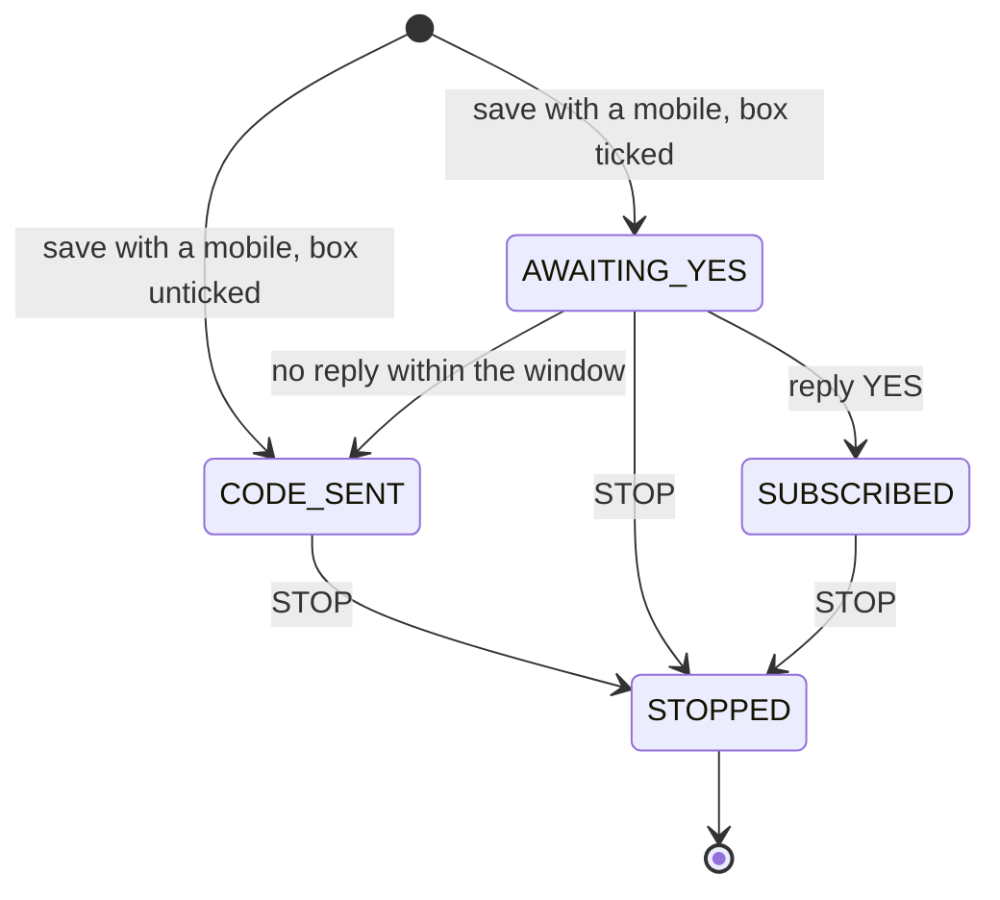

# Flow 4 — the code by text, and the text opt-in

**Status: ⛔ OFF FOR OCTOBER — email only (ruled 2026-09-27).** Kept as the design for when texting
returns. Its consent ids are prefixed `CP-T` so they cannot be confused with the email flow's.

## 1. Purpose

A visitor who gave a mobile number gets their code **by text**, because the field said so. That is the
service they asked for. Marketing texts come only with a text box (CP-T1), and under the proposal below
only after they reply to confirm.

## 2. The messages

| id | when | says | kind |
|---|---|---|---|
| **S1** | the claim is accepted | *"Fit AF: your offer code is XXXX-XXXX (until [date]). Your plan: <link>. Reply STOP to opt out."* | service (the save) |
| **S1+** | the same message, **only if the text box was ticked** | adds: *"Reply YES to get Fit AF menus & offers by text (about 4/mo). Msg & data rates may apply. HELP for help."* | ⬜ the confirmation request (§ 4) |
| **S2** | one reminder before expiry | *"Fit AF: your offer XXXX-XXXX ends [date]. <link>"* | ⚠ service or marketing? **the consent draft leaves this to legal (F3).** Until it is answered, S2 goes only to claimants who confirmed marketing texts |
| **R-STOP** | any STOP | one confirmation that they are opted out; nothing after it | required |
| **R-HELP** | any HELP | who we are and how to reach us | required |

`<link>` opens the microsite with the plan in the fragment (Flow 5). A text is readable by anyone who can
see the phone, so ⛔ **the link carries no token that confirms anything or reveals anything beyond what
the text already says.**

## 3. States (of the text channel, per claim)

| state | meaning |
|---|---|
| `NONE` | no mobile given |
| `CODE_SENT` | S1 sent; no marketing texts |
| `AWAITING_YES` | S1+ sent; no marketing texts yet |
| `SUBSCRIBED` | they replied YES: marketing texts allowed |
| `STOPPED` | they replied STOP (from any state): nothing more, ever, unless they opt in again |

| # | from | event | to |
|---|---|---|---|
| 4.1 | — | claim with mobile, box unticked | `CODE_SENT` |
| 4.2 | — | claim with mobile, box ticked | `AWAITING_YES` |
| 4.3 | `AWAITING_YES` | reply YES | `SUBSCRIBED` (CP-T2) |
| 4.4 | `AWAITING_YES` | no reply within the window (⬜ 7 days) | `CODE_SENT`; the ticked box is recorded as **not confirmed** |
| 4.5 | any | reply STOP (or any reasonable opt-out wording) | `STOPPED` (CP-TW) |
| 4.6 | any | reply HELP | unchanged; R-HELP sent |

## 4. ⬜ Fork: is the ticked box enough, or do texts wait for YES?

| | the box is enough | ⭐ the box, then YES |
|---|---|---|
| the law's bar (federal rule for marketing texts) | met: a checkbox plus submit is a written, signed agreement | met, with a second, independent proof |
| a mistyped number | a stranger receives marketing texts until they reply STOP | a stranger receives **one** text (S1+) and nothing more |
| list size | larger | smaller: some people never reply |
| matches the email side | no (email has double opt-in) | ⭐ yes: both channels confirm before marketing |

⭐ **Recommended: the box, then YES.** It is the "highest standard" reading, and a mistyped number costs
one text instead of a stream of them. The federal rule allows one confirmation text after consent, and
S1+ is that text.

## 5. ⚠ Prerequisites, and the October risk

Before any text is sent, the sending number must be **registered with the US carriers for
application-to-person messaging** (for an ordinary 10-digit number this is the "10DLC" brand-and-campaign
registration; a toll-free number has its own verification). ⚠ Its requirements and **lead time have not
been read from the provider's documents yet**, and they decide whether texting can exist by late October.
A short code is already ruled out for October.

⇒ **The form offers Text only once a registered sender exists** (Flow 1). If there is none by the
trip, the October form is **email only**, and the page says nothing it cannot do.

Also to confirm from the provider's documents: whether it handles STOP/HELP itself (most providers do for
standard opt-out words) or whether we must, and how an opt-out reaches our record.

## 6. Consent points

| id | the act | means | evidence stored |
|---|---|---|---|
| **CP-T1** | (Flow 1) a text box plus save | written consent to marketing texts, pending YES under § 4 | `consent_sms = true`, time, wording version |
| **CP-T2** | replying YES | marketing texts confirmed | `consent_sms_confirmed_at`, and the provider's message id as proof |
| **CP-TW** | replying STOP (or equivalent), any time | all texts end; honoured at once | `sms_stopped_at`; forwarded to wherever the number was exported |

## 7. Data

- **Sent to the provider**: the number and the message text. Nothing else.
- **Received from it**: replies (YES / STOP / HELP) and their times. ⛔ **The text of any other reply is
  not stored.** A person may text anything, and we keep only what the flow needs.
- ⛔ The provider is an **output conduit**, not the record (the record is Flow 6's).
