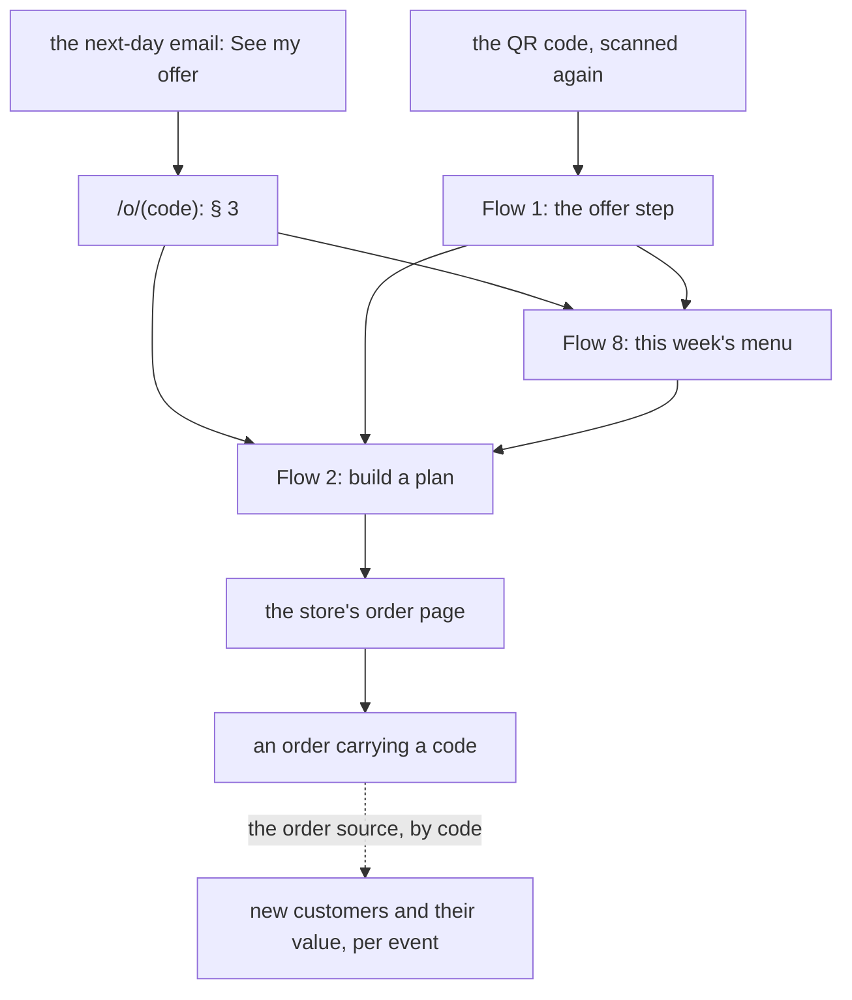
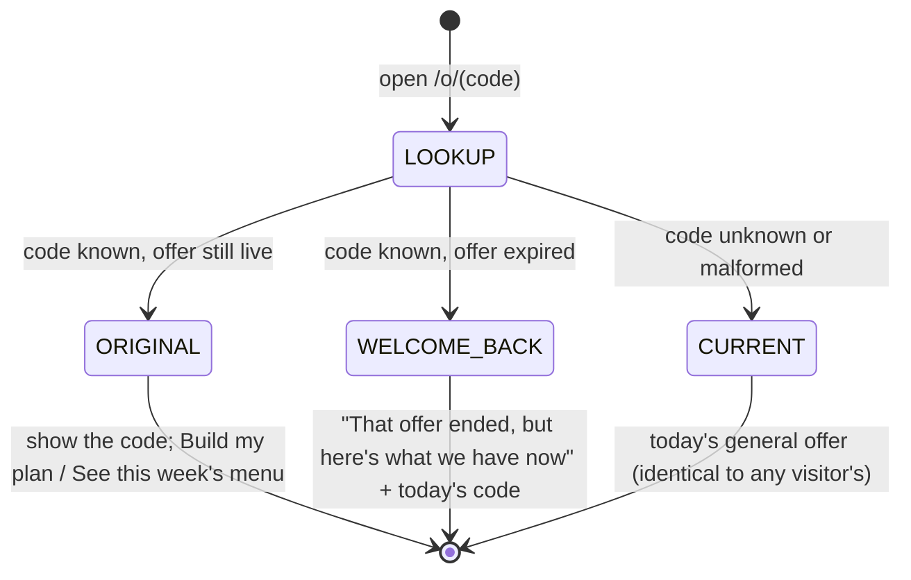

# Flow 5 — come back (even a year later), and use a code at the store

**Status: rung 1's links are BUILT; the rest is PROPOSED.** The pre-filled cart is
`SPEC-rung2-cart-handoff.md` (planned; it waits on the store's tag-container setting).

## 1. Purpose

**A lead may convert in 0 minutes, 3 weeks or a year, and there is always something for them.** This flow
is every route back, and the step onto the store with a code in hand. ⭐ **Redemption is permissive**: if
the original offer has expired, the visitor is offered **whatever is current** instead of a dead end.

## 2. The ways back

| from | lands on | carries |
|---|---|---|
| the same visit | Flow 2 or 8 → the store | the code, if they saved it |
| E1's **See my offer** | `/o/<code>` (§ 3) | the offer code only |
| the QR code again | Flow 1 | nothing |
| a marketing email (only after CP3) | wherever that email links | decided per campaign |

⭐ **The plan comes back; the meals are this week's.** A returning visitor always sees **the current week's
menu**, never the week they saved in.

## 3. ⭐ `/o/<code>` — the offer page, never a dead end

| state | when | the page shows |
|---|---|---|
| `ORIGINAL` | the code is in the save record and its offer is live | their code and its expiry; the two ways on |
| `WELCOME_BACK` | the code is known, its offer has expired | *"Welcome back — that offer ended, but here's what we have now"*: **the current offer**, with a code for it (§ 4); the two ways on |
| `CURRENT` | unknown or malformed code | the current general offer, **exactly as any visitor sees it**, so the page reveals nothing about whether a code exists |

- The lookup needs **only the save row** (event, code, dates), which is kept after the contact is deleted
  (Flow 6). ⭐ **So a year later, with no personal data left anywhere on our side, the link still works**,
  and still knows which event the person came from.
- Rate-limited per IP. Codes are random and unguessable, and guessing one gains only an offer anyone can
  get.

## 4. What "the current offer" is

⬜ **An input, owned by the Owner**: a dated list of offers (`data/offers.json`, placeholders until
approved), each with its terms and validity. At any moment, one is current.

| | a shared code for the current offer | ⭐ a new unique code, linked to the original save |
|---|---|---|
| attribution | lost: anyone can use it | ⭐ **kept**: the new code points back to the old save row, so a conversion a year later still counts for its event |
| needs | a code the store accepts | the store accepting a pool of unique codes (being confirmed) |
| personal data | none | none: the link is code → code |

⭐ **Recommended: a unique code linked to the original save**, falling back to the shared code if the store
cannot take a pool.

## 5. Onto the store

| rung | the button goes to | the code |
|---|---|---|
| **1 (now)** | the plan's order page | copied from the page or the email, entered at checkout |
| **2 (planned)** | the order page plus a fragment the store-side tag reads | carried in the fragment and entered through the store's own coupon field |

Without the tag, the link is exactly rung 1.

## 6. Redemption, and what it tells us

- The store records the code on the order, and **we do not see the order**. The trip's metrics come from
  the order source **by code**, and each code maps to its event, including a code issued a year later
  (§ 4).
- The same by-code lookup is what suppresses the next-day email for someone who already ordered (Flow 3
  § 3).
- ⬜ Whether an offer is tied to a plan is the offer's terms, and those are the Owner's.
