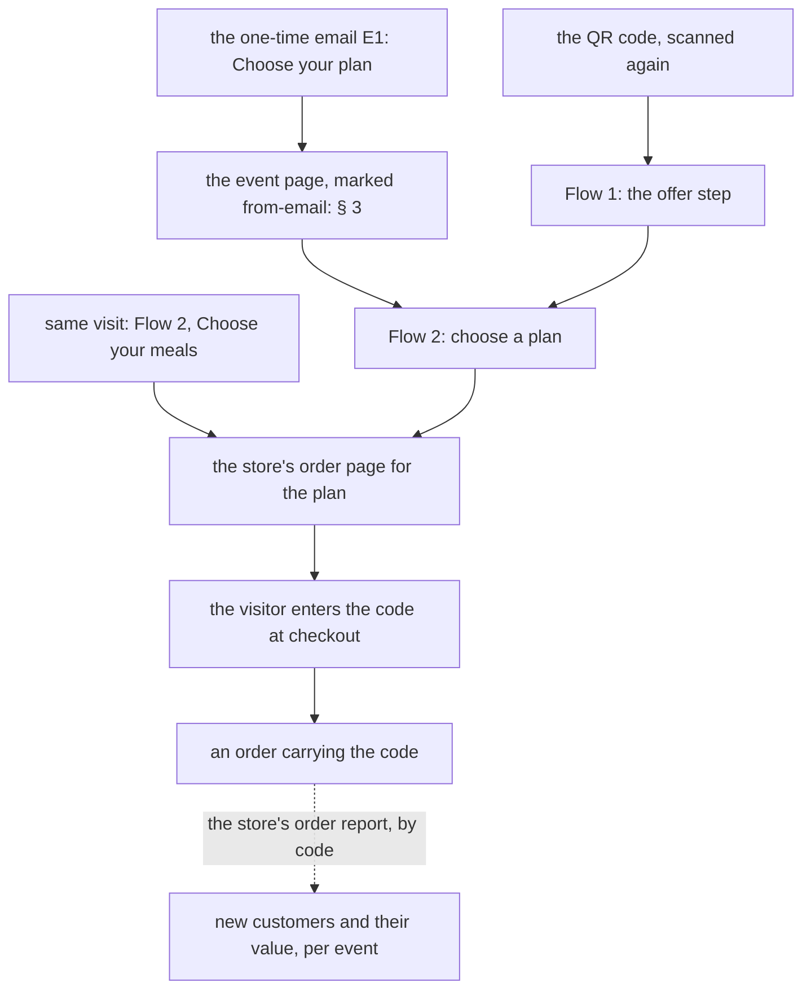

# Flow 5 — come back, and use the code at the store

**Status: rung 1's links are BUILT; the rest is PROPOSED.** The pre-filled cart is
`SPEC-rung2-cart-handoff.md` (planned; it waits on the store's tag-container setting).

## 1. Purpose

**A lead may convert in 0 minutes or 3 weeks, and the offer holds either way.** This flow is every route
back, and the step onto the store with the code in hand.

## 2. The ways back

| from | lands on | carries |
|---|---|---|
| the same visit | Flow 2 → the store | the plan (and the code, if they saved it and have it open) |
| E1's **Choose your plan** | the event page, straight to Flow 2 (§ 3) | nothing personal; the code is in the email |
| the QR code again | Flow 1 | nothing |
| a marketing email (only after CP3) | wherever that email links | decided per campaign |

⭐ **The plan comes back; the meals are this week's.** When Chef's Choice exists, a returning visitor sees
**the current week's picks**, not the week they saved in: the menu rotates.

## 3. The link back skips the offer step

E1's link is the event page with a marker that says only *"from the email"* (`#from-email`), which opens
at Flow 2 and shows no offer form, because they already saved it. The marker carries **no identity**.
Anyone with the link sees the same page.

## 4. Onto the store

| rung | the button goes to | the code |
|---|---|---|
| **1 (now)** | the plan's order page | the visitor copies it from E1 and enters it at checkout |
| **2 (planned)** | the order page plus a fragment the store-side tag reads | carried in the fragment; the tag enters it through the store's own coupon field |

Rung 2's rule carries over: **without the tag, the link is exactly rung 1.** In rung 2 the fragment may
carry the code, which is the holder's own, and **nothing else personal**.

## 5. Redemption, and what it tells us

- The store records the code on the order. **We do not see the order.** The trip's metrics (new customers,
  their lifetime value) come from the store's order reports **by code**, and each code maps to its event.
- ⭐ **The code is the only link from an order back to the event**, and it is what is kept after the
  contact is deleted (Flow 6). So it must be **unique per save**, drawn from a pool of codes the store
  accepts. Whether the store accepts such a pool is being confirmed.
- ⬜ Whether the offer is tied to a plan is the offer's terms, and those are the Owner's.

## 6. After the offer

An expired code is refused at the store's checkout, as any expired code is. A **new** offer for a lead who
did not convert is a **new message**, sent **only** to someone who confirmed marketing (CP3). ⛔ It never
goes to someone who only saved the offer.
