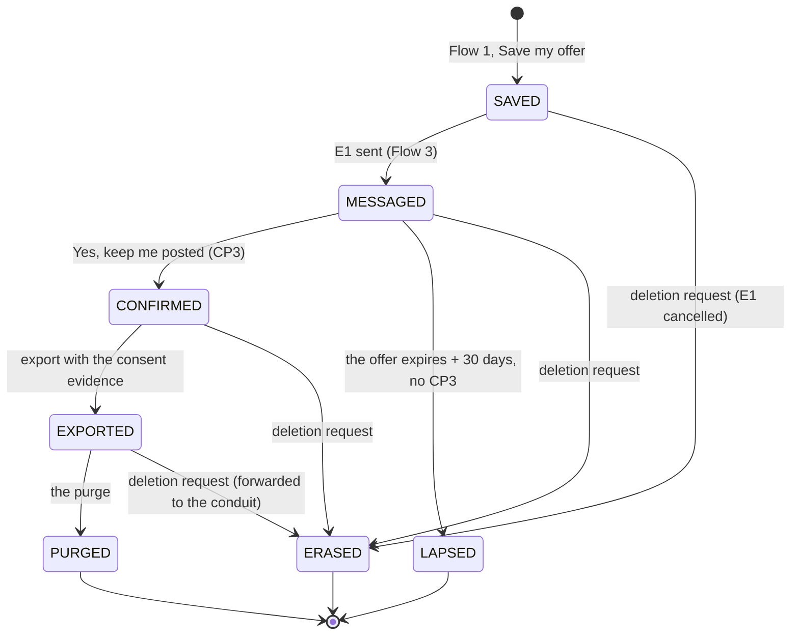

# Flow 6 — the lead record, from save to deletion

**Status: the deletion plan is ACCEPTED (2026-09-27); partly built on dev** (two tables, `export_state`
`pending · exported · purged`, the purge of exported records: `SPEC-rung3-lead-capture.md` §§ 3–6). Email
only for October.

## 1. Purpose

Our own record of a saved offer is the system of record until the contact is exported, and it is **built
to forget**. Once a contact is deleted, only the **save** remains: event, ZIP prefix (⬜ or nothing), offer
code and dates. Nothing in it identifies a person.

## 2. States

| state | means | the contact row |
|---|---|---|
| `SAVED` | accepted; E1 scheduled | present |
| `MESSAGED` | E1 sent (or failed for good: § 3) | present |
| `CONFIRMED` | the marketing box was ticked **and** confirmed from the inbox (CP3) | present |
| `EXPORTED` | handed to the email conduit **with the consent evidence** | present until the purge |
| `PURGED` | deleted after export | **gone** |
| `LAPSED` | deleted without export: no marketing confirmation, and the retention period is over | **gone** |
| `ERASED` | deleted **on request** | **gone** |

`PURGED`, `LAPSED` and `ERASED` are end states. The save row stays in all three, and which one it is stays
recorded: it is how we count, not who.

## 3. Transitions

| # | from | event | to | effect |
|---|---|---|---|---|
| 6.1 | — | a save is accepted (Flow 1) | `SAVED` | save + contact written; code drawn; `send_at` set |
| 6.2 | `SAVED` | the cron sends E1, or gives up after retries | `MESSAGED` | `sent_at` or `failed_at` |
| 6.3 | `MESSAGED` | CP3 | `CONFIRMED` | `consent_marketing_confirmed_at` |
| 6.4 | `CONFIRMED` | the export runs | `EXPORTED` | ⬜ the export (§ 5) |
| 6.5 | `EXPORTED` | the purge runs | `PURGED` | contact deleted (**built**, `purge.js`) |
| 6.6 | `MESSAGED` | offer expiry + 30 days, no CP3 | `LAPSED` | contact deleted. ⬜ **to build**: today's purge touches only exported records |
| 6.7 | any live state | a deletion request | `ERASED` | contact deleted; an unsent E1 cancelled; forwarded to the conduit if exported |
| 6.8 | any live state | **No thanks** or an unsubscribe while the contact is ours | unchanged | the box recorded as withdrawn, with the time; it can no longer reach `EXPORTED` |

## 4. Timers

| timer | value | source |
|---|---|---|
| when E1 goes | the visitor's choice (Flow 1 § 5) | the save |
| retention without marketing confirmation | offer expiry + 30 days | the consent draft |
| the purge after export | as soon as the export is confirmed | the ruling: destroyed after export |

**How timers run**: one scheduled Worker (a cron trigger) sends what is due (Flow 3) and runs the purge
module for 6.5 and 6.6. A scheduled job cannot be forgotten, which is what "built to forget" needs. ⛔ Any
run a person starts by hand is a dry run by default.

## 5. The export (a later rung)

- **Exported**: only contacts in `CONFIRMED`. A contact that only saved the offer is **never** exported. It
  is deleted by 6.6.
- **With each contact**: `event_id`, and the consent evidence: `consent_at`, `consent_marketing_confirmed_at`,
  both wording versions. Once the contact is purged, the conduit holds the only proof of consent, so the
  proof must travel with it.
- ⬜ The status a contact is created with at the conduit (subscribed, with our double-opt-in evidence, rather
  than a second confirmation from the conduit) is read from the conduit's API documentation when this rung
  is written.

## 6. What is never in the record

The IP address · the user agent · location beyond ZIP · anything about health or goals · the
confirmation token in the clear (a hash is enough to match) · the text of any bounce beyond its kind.

## 7. Two databases

Development holds **dummy data only**. Production is **created empty** when the wording is approved.
"Cleared before real use" is true by construction, never by a delete someone has to remember.
