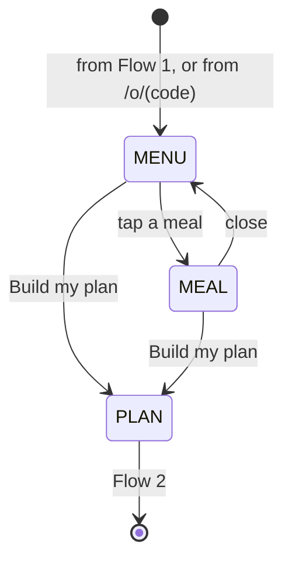

# Flow 8 — see this week's menu

**Status: PROPOSED, not built.** It is one of the two things a person who skips the offer is saying
(Flow 1). It depends on two inputs that do not exist here yet: the week's menu and its photographs.

## 1. Purpose

Show **what is on the menu this week**: the meals, with a photograph, and what each gives at each size.
From here the visitor builds a plan (Flow 2) or goes straight to the store.

## 2. Inputs, and what regenerates them

| input | from | rebuilt |
|---|---|---|
| `data/menu/<sunday-date>.json`: the week's meals, public names, per-size numbers | the enterprise's weekly menu (a week is dated by its Sunday delivery), exported as **public fields only** | weekly |
| `data/photos/<sunday-date>.json` + images | the photograph selection (Flow 2 § 8) | weekly |

⛔ **Public fields only**: a meal's public name, its photograph, and its published per-size numbers.
Nothing from inside the kitchen (recipes, suppliers, costs) is ever an input here.

⭐ **The page is an output of the week.** A week with no menu file builds the page **without** this flow's
link, rather than showing last week's meals.

## 3. States

| state | the page shows |
|---|---|
| `MENU` | this week's meals as photographs with names; a size switch (Lean · Signature · Performance) that changes the numbers shown under each |
| `MEAL` | one meal: its photograph, and calories and protein at each size |
| `PLAN` | leave for Flow 2 |

The size switch uses the same values and fragment as Flow 2 (`#lean`), so a size picked here carries over.

## 4. Later

- **Chef's Choice**: the week's picks shown as a bundle, pre-filled into the cart through rung 2.
- The same share arithmetic as Flow 2 § 2, per meal, under the same rule: computed in the browser, never
  sent.
