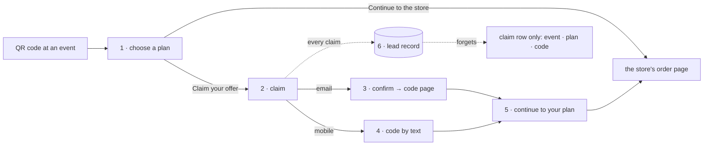

# flows — the microsite's multi-step flows, documented before they are built

**The rule of this directory**: each flow is written here **before** its code, **framework-neutral**:
states, transitions, the data each step sends or keeps, and the consent points. The choice of how to
build the page (plain script, or a small framework) **follows these documents**. Like everything in this
repository, these files are public: no offer terms before they are approved, no internal figures, no
pointer into a private repository.

**Authority.** Where a flow and a contract (`../SPEC*.md`) disagree about something BUILT, the contract
and the code win, and the flow is corrected. Where a flow PROPOSES a change, the contract is amended when
the proposal is accepted, and not before.

## The flows

| | flow | status | its page or channel |
|---|---|---|---|
| [1](01-choose.md) | arrive and choose a plan | ✅ built (rung 1, live) | the microsite |
| [2](02-claim.md) | claim the offer | 🟡 built on dev as one form; **streamlining proposed** | the microsite |
| [3](03-confirm-email.md) | confirm the email and reveal the code (double opt-in) | ⬜ proposed | email → `/c/<token>` |
| [4](04-text.md) | the code by text, and the text opt-in | ⬜ proposed; ⚠ needs a registered sender | text messages |
| [5](05-return-and-redeem.md) | come back, and use the code at the store | rung-1 links built; the rest proposed | microsite → store |
| [6](06-lead-record.md) | the lead record, from claim to deletion | 🟡 partly built on dev | the Worker and its database |
| [7](07-calendar-cart.md) | the calendar cart | 💭 sketch, later | the microsite |

## The journey, end to end

Drawn from the transition tables in each flow; the tables are the authority.

## Consent points — the register

Every place a person gives or withdraws permission, in one list. The id is used in every flow that refers
to it.

| id | where | the act | means |
|---|---|---|---|
| CP1 | Flow 2 | submitting a claim | send **this offer** and **one reminder** to the contact given (service, not marketing) |
| CP2 | Flow 2 | the email box | marketing email: **pending** until CP4 |
| CP3 | Flow 2 | the text box | written consent to marketing texts: pending CP5 under Flow 4 § 4 |
| CP4 | Flow 3 | **Show my code** | the address is theirs; with CP2, marketing email confirmed |
| CP5 | Flow 4 | replying YES | marketing texts confirmed |
| CP-W1 | any email | unsubscribe | marketing email withdrawn |
| CP-W2 | any text | STOP | all texts withdrawn |
| CP-W3 | anywhere | asking us to delete | contact deleted (Flow 6 `ERASED`), forwarded to any conduit |

⭐ **Symmetry, by construction**: each channel is **offered beside its own field** (CP2 · CP3),
**confirmed by its owner** (CP4 · CP5), and **withdrawn in one step** (CP-W1 · CP-W2).

## How much state there is — for the framework decision

| flow | where the state lives | named states |
|---|---|---|
| 1 | the URL fragment (3 values) + one toggle | 5 |
| 2 | the page | 8 |
| 3 | the Worker; the page renders one of 4 outcomes and has one button | 4 |
| 4 | the Worker and the text provider; **no page** | 5 |
| 5 | links only | 0 new |
| 6 | the Worker and its database; **no page** | 6 |
| 7 | the page: a 7 × 6 grid, a menu, drag state, and prices derived on every drop | many, and interdependent |

**Reading it**: flows 1–6 put **13 states on a page** (1 and 2), plus one server-rendered page with one
button (3). Everything else is server-side, where no front-end framework applies. That is well within what
the current plain script handles, and a framework would add a build step for a small gain. **Flow 7 is
the first flow whose state is large and interdependent**, which is where a component framework earns its
keep.

⇒ **Recommendation**: build flows 2–6 plain for October, on the existing `build.mjs`, and take the
framework decision when Flow 7 is scheduled. ⬜ The decision is the Advisor's.

## Open across flows

| where | question |
|---|---|
| Flow 1 § 5 | an entry path per event (`/<event-id>/`), so a claim records its event |
| Flow 1 § 6 · Flow 2 § 2 | **Claim your offer** leads the card; the claim asks for one channel at a time |
| Flow 2 § 6 | one claim per contact per event (a resend is a resubmission) |
| Flow 2 § 7 | the ZIP check the form promises and does not make |
| Flow 3 § 4 · Flow 4 § 3 | the 7-day confirmation windows |
| Flow 3 § 8 | **which email sender**: nothing can confirm an address until one exists |
| Flow 4 § 4 | marketing texts wait for YES |
| Flow 4 § 5 | ⚠ carrier registration for texts, and its lead time; **email only for October** if no sender is ready |
| Flow 5 § 4 | the reminder's timing; whether a text reminder is service or marketing (the consent draft's F3, for legal) |
| Flow 6 § 4 | timers by a scheduled Worker; the purge for claims that are never exported |
| Flow 6 § 5 | the export, and the status a contact is created with at the conduit |
