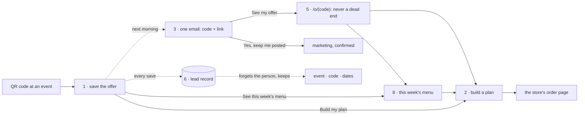

# flows — the microsite's multi-step flows, documented before they are built

**The rule of this directory**: each flow is written here **before** its code, **framework-neutral**:
states, transitions, the data each step sends or keeps, and the consent points. Each flow carries a
Mermaid diagram of its states. **The tables are the authority**, and the diagrams are drawn from them. Like
everything in this repository, these files are public: no offer terms before they are approved, no
internal figures, no pointer into a private repository.

**Pictures.** [`rendered/`](rendered/README.md) holds every diagram here as an SVG (committed) and a 2×
PNG (for a screen share), drawn in the page's colours and fonts by `npm run render:flows`. They are
outputs of these blocks: after changing a diagram, re-render and commit the SVG with it (test F1 fails
on a stale one).

**Authority.** Where a flow and a contract (`../SPEC*.md`) disagree about something BUILT, the contract
and the code win, and the flow is corrected. Where a flow PROPOSES a change, the contract is amended when
the proposal is accepted.

## Ruled 2026-09-27

- **The offer comes first**, as a dismissible **reminder**: one email with the code and a link back, sent
  **the next day** so the day's orders come through first. Then build a plan, or see this week's menu.
- **Skipping says what the person wants**: *build my plan* (word open) or *see this week's menu*.
- **Question 1 is a meal size, not a goal**: the page shows what each size provides, and at most does the
  arithmetic on a daily target the person types in (kept in the browser).
- **Redemption is permissive**: the email's link keeps working after the offer ends and offers whatever is
  current.
- **Email only for October**, sent through **Resend**; texting is off.
- **Build a plan will be rewritten** around meal photography.
- **ZIPs**: a whitelist, mocked for greater Boston until the official list replaces it.
- **Plain JavaScript shaped like components** now, with a Svelte refactor expected.
- **The calculator takes protein and/or calories**, each independent, including a calorie remainder "from
  the rest of your day".
- **Out-of-area visitors may join an expansion list**, segmented by a ring just outside today's reach.
- **The deletion plan (Flow 6) is accepted.**

## The flows

| | flow | status | its page or channel |
|---|---|---|---|
| [1](01-save-offer.md) | save the offer (first, dismissible) | ✅ built on dev (rung 4) | the microsite |
| [2](02-choose.md) | build a plan: meal size, then how many | ✅ live (rung 1); meal size + calculator on dev (rung 4); ⬜ photography rewrite | the microsite |
| [3](03-follow-up-email.md) | the next-day email, and the marketing confirmation | 🟡 `/confirm` and the schedule built on dev; sending waits on Resend | email → `/confirm/<token>` |
| [4](04-text.md) | the code by text | ⛔ off for October | text messages |
| [5](05-return-and-redeem.md) | come back (even a year later), and use a code | ✅ `/o/<code>` built on dev; the redemption source open | `/o/<code>` → store |
| [6](06-lead-record.md) | the lead record, from save to deletion | ✅ built on dev (rung 4); the export later | the Worker and its database |
| [7](07-calendar-cart.md) | the calendar cart | 💭 sketch, later | the microsite |
| [8](08-this-weeks-menu.md) | see this week's menu | ⬜ proposed; needs the menu and photo inputs | the microsite |

## The journey, end to end

## Consent points — the register

| id | where | the act | means |
|---|---|---|---|
| CP1 | Flow 1 | **Save my offer** | send **this code once, the next day**, with a link back (a service, not marketing) |
| CP2 | Flow 1 | the marketing box | marketing email, **pending** CP3 |
| CP-E | Flow 1, out of area | **Tell me when you deliver here** | expansion news for that area (ZIP + ring kept), **pending** confirmation from the inbox |
| CP3 | Flow 3 | **Yes, keep me posted** | marketing email confirmed (double opt-in) |
| CP-W1 | Flow 3 · any marketing email | **No thanks** · unsubscribe | marketing withdrawn, as easily as given |
| CP-W2 | anywhere | asking us to delete | contact deleted (Flow 6 `ERASED`); an unsent email cancelled; forwarded to the conduit |

Texting's own ids (`CP-T1`, `CP-T2`, `CP-TW`) are in Flow 4 and are off for October.

## How much state there is — plain now, Svelte expected

| flow | where the state lives | named states |
|---|---|---|
| 1 | the page | 11 |
| 2 | the URL fragment (3 values), one toggle, and the share panel (one number, browser only) | 5 |
| 8 | the page; the size shares Flow 2's fragment | 3 |
| 3 | the Worker (E1: 6); the confirmation page (4, one button) | 10, server-side |
| 5 | `/o/<code>`: rendered by the Worker | 4, server-side |
| 6 | the Worker and its database | 7, server-side |
| 7 | the page: a 7 × 6 grid, a menu, drag state, prices derived on every drop | many, interdependent |

**On a page for October: 19 states across flows 1, 2 and 8**, plus the share panel. Built plain, on the
existing `build.mjs`, and written the way a component would be, so the expected move to Svelte is a
translation rather than a rewrite:

- **state as one plain object per flow**, the only thing that changes;
- **one `render(state)` per flow**, which reads the state and writes the DOM, and nothing else does;
- **transitions as named functions** that match the rows in each flow's table.

## Open across flows

| where | question |
|---|---|
| Flow 1 § 2 | the words for the two skip links (and whether two is too many) |
| Flow 1 § 5 · Flow 6 | how long an expansion request is kept (⬜ proposed 12 months); the official ZIP list and ring |
| Flow 2 § 2 | the calculator (protein and/or calories): the Owner's review |
| Flow 2 § 6 | an entry path per event, so a save records its event |
| Flow 2 § 8 · Flow 8 § 2 | the photograph set and the weekly menu export (public fields only) |
| Flow 3 § 3 | **which order source the next-day check reads**, by code (open until the Owner's order-handling walkthrough); the send hour |
| Flow 3 § 4 | the Fit AF Resend account, the sending domain, the scoped key |
| Flow 5 § 4 | the dated list of current offers (the Owner's); a pool of unique codes the store accepts |
| Flow 6 § 5 | the export, and the status a contact is created with at the conduit |
