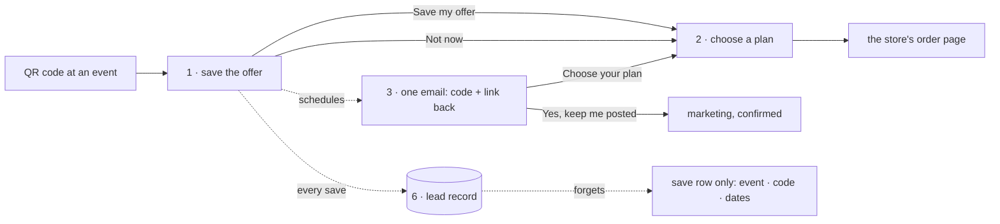

# flows — the microsite's multi-step flows, documented before they are built

**The rule of this directory**: each flow is written here **before** its code, **framework-neutral**:
states, transitions, the data each step sends or keeps, and the consent points. Each flow carries a
Mermaid diagram of its states. **The tables are the authority**, and the diagrams are drawn from them. Like
everything in this repository, these files are public: no offer terms before they are approved, no
internal figures, no pointer into a private repository.

**Authority.** Where a flow and a contract (`../SPEC*.md`) disagree about something BUILT, the contract
and the code win, and the flow is corrected. Where a flow PROPOSES a change, the contract is amended when
the proposal is accepted.

## Ruled 2026-09-27

- **The offer comes first**, as a dismissible **reminder**: one email with the code and a link back. Then
  choose a plan.
- **Email only for October**: texting is off.
- **Choose a plan will be rewritten** around meal photography.
- **ZIPs**: a whitelist, mocked for greater Boston until the official list replaces it.
- **Plain JavaScript for now**, with a Svelte refactor expected.
- **The deletion plan (Flow 6) is accepted.**

## The flows

| | flow | status | its page or channel |
|---|---|---|---|
| [1](01-save-offer.md) | save the offer (first, dismissible) | ⬜ proposed; replaces the claim form built on dev | the microsite |
| [2](02-choose.md) | choose a plan | ✅ built (rung 1, live); ⬜ to be rewritten with photography | the microsite |
| [3](03-follow-up-email.md) | the one-time email, and the marketing confirmation | ⬜ proposed | email → `/confirm/<token>` |
| [4](04-text.md) | the code by text | ⛔ off for October | text messages |
| [5](05-return-and-redeem.md) | come back, and use the code at the store | rung-1 links built; the rest proposed | microsite → store |
| [6](06-lead-record.md) | the lead record, from save to deletion | ✅ plan accepted; partly built on dev | the Worker and its database |
| [7](07-calendar-cart.md) | the calendar cart | 💭 sketch, later | the microsite |

## The journey, end to end

## Consent points — the register

| id | where | the act | means |
|---|---|---|---|
| CP1 | Flow 1 | **Save my offer** | send **this code once**, at the chosen time, with a link back (a service, not marketing) |
| CP2 | Flow 1 | the marketing box | marketing email, **pending** CP3 |
| CP3 | Flow 3 | **Yes, keep me posted** | marketing email confirmed (double opt-in) |
| CP-W1 | Flow 3 · any marketing email | **No thanks** · unsubscribe | marketing withdrawn, as easily as given |
| CP-W2 | anywhere | asking us to delete | contact deleted (Flow 6 `ERASED`); an unsent email cancelled; forwarded to the conduit |

Texting's own ids (`CP-T1`, `CP-T2`, `CP-TW`) are in Flow 4 and are off for October.

## How much state there is — plain now, Svelte expected

| flow | where the state lives | named states |
|---|---|---|
| 1 | the page | 9 |
| 2 | the URL fragment (3 values) + one toggle | 5 |
| 3 | the Worker (E1: 5); the confirmation page (4, one button) | 9, server-side |
| 5 | links only | 0 new |
| 6 | the Worker and its database | 7, server-side |
| 7 | the page: a 7 × 6 grid, a menu, drag state, prices derived on every drop | many, interdependent |

**On a page for October: 14 states (flows 1 and 2).** Built plain, on the existing `build.mjs`. So that
the expected move to Svelte is a translation rather than a rewrite, the plain code is written the way a
component would be:

- **state as one plain object per flow**, the only thing that changes;
- **one `render(state)` per flow**, which reads the state and writes the DOM, and nothing else does;
- **transitions as named functions** that match the rows in each flow's table.

## Open across flows

| where | question |
|---|---|
| Flow 1 § 5 | when E1 goes: ⭐ the visitor chooses (now · this evening · tomorrow morning) |
| Flow 1 § 6 | what an out-of-area visitor may do (the Owner's) |
| Flow 1 § 7 | whether the email reopens the plan chosen afterwards (⭐ not for October) |
| Flow 2 § 5 | an entry path per event, so a save records its event |
| Flow 2 § 7 | the rewrite, and the photograph set it needs |
| Flow 3 § 6 | the sending domain and the sender account |
| Flow 5 § 5 | a pool of unique codes the store accepts |
| Flow 6 § 5 | the export, and the status a contact is created with at the conduit |
